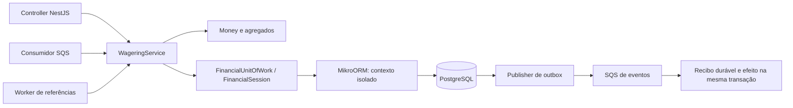
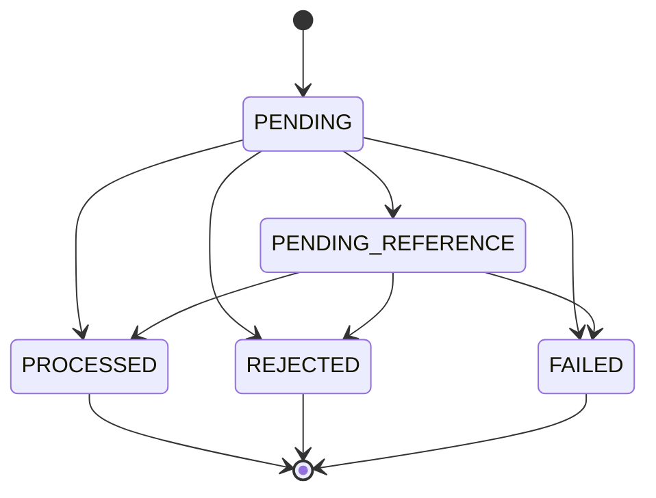

# Arquitetura do processador de apostas

Implementação construída a partir da [especificação](specs/001-distributed-wagering/spec.md). PostgreSQL é a autoridade financeira. NestJS organiza o adaptador HTTP e a injeção; o domínio é TypeScript sem imports de NestJS, ORM ou AWS. [Evidências](docs/VALIDATION.md) e [rastreabilidade](docs/TRACEABILITY.md) permitem verificar as decisões.

## Limites e componentes

| Diretório                        | Responsabilidade                                                                  |
| -------------------------------- | --------------------------------------------------------------------------------- |
| `src/domain`                     | Money, Wallet, WagerTransaction, ledger, inbox/outbox e eventos                   |
| `src/application`                | Orquestração financeira, mappers de saída, contratos, clock, fault hooks e portas |
| `src/infrastructure/persistence` | EntitySchemas, mappers, Unit of Work, consultas e migrations                      |
| `src/infrastructure/messaging`   | SQS, claims, retries, auditoria DLQ e recuperação                                 |
| `src/adapters`                   | HTTP NestJS, erros, health, métricas e lifecycle                                  |
| `src/infrastructure/runtime.ts`  | Composição das dependências                                                       |

As entradas validam contratos e chamam o mesmo `WageringService.process`. O job de referências reusa a mesma aplicação de regras sobre o agregado persistido. Consulta/reconciliação ficam no adaptador SQL: não movimentam saldo. Cada transação usa `em.fork().transactional()`; não há Identity Map compartilhado entre trabalhos concorrentes.

## Organização de tipos e contratos

Tipos e interfaces ficam em pastas `types/` na camada que possui o contrato, agrupados por assunto. Os consumidores importam diretamente do arquivo responsável usando `import type`.

Mappers ficam em `mappers/` na camada que possui a transformação. Na aplicação, `toStoredResult` inclui o snapshot interno persistido e `toPublicProcessingResult` seleciona explicitamente os campos expostos. `toWalletView` normaliza a saída da wallet tanto na abertura quanto na consulta SQL.

| Pasta                                   | Contratos                                                                                         |
| --------------------------------------- | ------------------------------------------------------------------------------------------------- |
| `src/domain/types`                      | Dinheiro, carteira/ledger, apostas, eventos e inbox/outbox                                        |
| `src/application/types`                 | Processamento de apostas, visão de carteira, sessão financeira, execução e identidade do provedor |
| `src/infrastructure/persistence/types`  | Banco/EntityManager e resultados SQL de reconciliação                                             |
| `src/infrastructure/messaging/types`    | Filas, claims e efeito downstream                                                                 |
| `src/infrastructure/types`              | Composição do runtime                                                                             |
| `src/adapters/types`                    | Request e response HTTP                                                                           |
| `tests/helpers/types` e `scripts/types` | Mensagens IPC e relatórios de verificação                                                         |

As constantes `wagerKinds` e `RUNTIME` ficam em `constants/` nas camadas de domínio e infraestrutura, respectivamente. `contracts.ts` conserva parsing, hash, validação e erros; as portas financeiras estão em [types/financial.ts](src/application/types/financial.ts). O resultado persistido reutiliza `StoredResult`, e o ledger reutiliza `LedgerDirection`. A separação mantém a direção das dependências e os mesmos contratos financeiros e de transporte.

## Vocabulários tipados

Enums em `constants/` centralizam status, kinds, direcoes do ledger, codigos de erro, SQLSTATEs, tipos de evento, mensagens e eventos de log. O Unit of Work converte a violacao unica do PostgreSQL em `PersistenceError` da aplicacao; o schema atual deriva seus valores financeiros dos enums e mantem mensagens diagnosticas. As migrations historicas preservam os literais SQL da versao original para manter a semantica de cada migration.

## Decisões

| ID     | Decisão                                                     | Consequência                                                                               |
| ------ | ----------------------------------------------------------- | ------------------------------------------------------------------------------------------ |
| ADR-01 | MikroORM 6.6.0 com EntitySchema fora do domínio             | Unit of Work explícita, entidades sem decorators de ORM; runtime Bun 1.4.2 e NestJS 12.1.2 |
| ADR-02 | Money em centavos `bigint`; SQL `NUMERIC(20,2)`             | Parsing, aritmética, comparação do ORM e JSON preservam exatidão                           |
| ADR-03 | `PESSIMISTIC_WRITE`/`FOR UPDATE` na wallet                  | Uma wallet serializa seus escritores; outras avançam independentemente                     |
| ADR-04 | Identidades únicas e resultado terminal persistido          | Replay recupera o saldo histórico e resiste a reinício                                     |
| ADR-05 | Inbox/outbox no commit financeiro                           | ACK e publicação ficam depois do commit; entrega externa permanece pelo menos uma vez      |
| ADR-06 | Claim curto, `SKIP LOCKED`, lease e token                   | Workers compartilham trabalho e recuperam crashes sem rede na transação financeira         |
| ADR-07 | Reconciliação em uma instrução SQL                          | Wallet e soma do ledger usam o mesmo snapshot MVCC                                         |
| ADR-08 | Uma reversão direta total por referência, mesmo entre tipos | Evita crédito duplicado; rollback do REFUND continua válido                                |
| ADR-09 | OIDC opcional com Keycloak e vínculo de provider por `azp`  | Auth desligada por padrão; tokens são verificados por issuer, audience, validade e JWKS    |
| ADR-10 | Diário imutável de partidas dobradas por movimento          | Passivo da carteira e conta interna de compensação fecham no mesmo commit                  |
| ADR-11 | Spans OTel manuais e OTLP/HTTP opcional                     | Instrumentação explícita em HTTP/SQS; exporter desligado por padrão                        |
| ADR-12 | Grafana, Prometheus e Tempo em perfil Compose opcional      | Painéis locais de métricas e traces sem acoplar disponibilidade à API financeira           |

## Dinheiro e agregados

Money é imutável e aceita strings não negativas com exatamente duas casas, moeda ISO-4217 e magnitude abaixo de `10^18` unidades. Entradas numéricas, notação científica, espaços e precisão extra falham. Resultados internos podem ser negativos para `subtract`/`negate` e reconciliação.

`DecimalStringType` valida strings e compara texto canônico, sem coerção numérica. O `DecimalType` padrão do MikroORM 6.6 usa floating point em `compareValues`, mesmo no modo string; por isso foi substituído. Há um teste real de `900719925474099.01 + 0.01`, incluindo persistência e reconciliação.

Wallet encapsula saldo e versão. `credit/debit` retornam um ledger imutável com antes/depois e incrementam versão apenas se há mudança financeira. Abertura positiva é o caso especial: versão 1, transação interna OPENING e crédito de `0.00` ao saldo inicial. Abertura zero não gera ledger. OPENING externo é inválido.

Factories aplicam invariantes de criação. `rehydrate` restaura estado sem repetir transições. Datas e payloads recebem cópias defensivas; eventos e payloads monetários são JSON com strings, sem BigInt exposto.

## Schema e autoridade SQL

| Registro             | Proteção                                                                                                                                          |
| -------------------- | ------------------------------------------------------------------------------------------------------------------------------------------------- |
| `wallets`            | UNIQUE jogador/moeda; saldo não negativo; versão >=1; runtime atualiza somente balance/version/updatedAt                                          |
| `wager_transactions` | UNIQUE chave global e provedor/ID externo; kind/status válidos; resultado terminal obrigatório; payload e estados terminais imutáveis por trigger |
| `wallet_ledger`      | UNIQUE wallet/transação e wallet/versão; CHECK positivo, não negativo e aritmética; FKs; triggers bloqueiam UPDATE/DELETE/TRUNCATE                |
| Diário contábil      | `accounting_journals` e duas linhas imutáveis por ledger; CHECK de contas/lados e trigger diferido valida origem e igualdade dos totais           |
| Reversões            | UNIQUE parcial por referência entre tipos em REFUND/ROLLBACK PROCESSED; rejeição não ocupa índice                                                 |
| `inbox`              | PK consumer/message; hash e operação confirmados; runtime insere e consulta, sem UPDATE/DELETE                                                    |
| `outbox`             | ID e aggregateId coerentes com o envelope; runtime altera somente publicação, tentativas e lease                                                  |
| `failed_deliveries`  | Auditoria durável por messageId e hash; sem payload financeiro nos logs                                                                           |
| `event_receipts`     | UNIQUE consumer/eventId; recibo e efeito downstream devem confirmar juntos                                                                        |

Constraint triggers deferidas verificam no commit a soma assinada do ledger, a versão e a continuidade do saldo; exigem um ledger para cada operação financeira processada, nenhum para LOSS/rejeições, moeda/contexto corretos e direção coerente com kind/referência. Escrita SQL que altera apenas saldo ou grava PROCESSED sem ledger falha. Payload rejeitado por moeda/jogador divergente pode permanecer auditável.

A migration 007 preenche o diário para movimentos históricos já processados e recusa a migration se faltar ledger de origem. Cada movimento gera partidas contrárias entre o passivo da wallet e a conta técnica de compensação. No commit, triggers diferidos exigem exatamente um débito e um crédito de igual valor e moeda, ligados à transação, wallet e ledger de origem. `LOSS` e estados sem movimento não têm diário. `GET /wagering/transactions/:transactionId/accounting-journal` expõe as partidas sem permitir escrita ou alteração do histórico.

Resultados terminais guardam `snapshotVersion` dentro do JSONB persistido, sem expor esse campo na API. O trigger confere identidade, status, moeda e saldo do resultado contra o lançamento naquela versão. Isso preserva o replay histórico de `LOSS`, que não cria ledger nem incrementa a versão. A migration 006 instala a validação mantendo resultados anteriores sem snapshot compatíveis.

FKs financeiras são deferidas e não apagam histórico por cascade. Isso permite o flush atômico do ORM sem depender da ordem de INSERT das classes. `wagering_app` não é dono das tabelas, não pode desativar triggers e não tem credenciais de migração no container. O owner existe somente em setup/teste.

Os triggers fixam `search_path=pg_catalog,public,pg_temp`: a aplicação não consegue substituir os dados usados pelo auditor com tabelas temporárias homônimas. Um teste SQL tenta esse contorno e comprova o rollback. A precedência segura de schemas segue a [documentação de CREATE FUNCTION](https://www.postgresql.org/docs/current/sql-createfunction.html).

O auditor mantém soma, contagem, versão e cadeia completa do ledger, portanto conserva custo O(histórico da wallet) e pode executar mais de uma vez por transação. A migration 010 limita os joins de transação/snapshot/referência à operação afetada: o trigger de transação usa seu ID; o de ledger usa seu `transaction_id`. Histórico terminal e ledger são imutáveis, e suas validações anteriores permanecem válidas. O trigger de wallet continua conferindo a cadeia inteira e recusa mudança de jogador/moeda. Não há marcador de sessão que dispense checks posteriores: `SET CONSTRAINTS` e múltiplos movimentos na mesma transação continuam verificando o estado final e cada operação afetada. A migration 009 acrescenta índices parciais não únicos para OPENING e telemetria pendente; não altera identidades financeiras.

## Transação e concorrência

1. Validar e normalizar comando; calcular SHA-256 do negócio.
2. Abrir contexto isolado e transação. Para SQS, adquirir advisory lock transacional da identidade inbox; depois adquirir lock da chave de idempotência.
3. Conferir inbox/chave/hash. Replay terminal usa o resultado persistido; replay pendente consulta estado durável atual.
4. Adquirir a linha da wallet com `FOR UPDATE`, relendo o estado. Conferir identidade externa, jogador, moeda e referência.
5. Aplicar domínio; salvar wallet/ledger quando muda dinheiro e salvar transação/eventos. Confirmar inbox quando aplicável.
6. Flush/commit. Depois responder HTTP ou enviar DeleteMessage. O publisher é outro trabalho.

Advisory locks são por identidade, nunca um mutex global de todas as wallets; as constraints UNIQUE continuam a autoridade final. Ordem: inbox → idempotency key → wallet → escrita da operação. Referências de outra wallet são consultadas para rejeição sem tentar adquirir uma segunda wallet.

Claims de lease confirmam antes de entrar no fluxo financeiro. Atualizações exclusivamente operacionais de lease não disparam o auditor que bloquearia a wallet, evitando inverter a ordem de locks. O retry de referência verifica o token atual antes de alterar a operação.

`lock_timeout=5s`. SQLSTATE 40P01, 40001 e 55P03 permitem até três tentativas com novo contexto e espera de 20/40 ms. Outros erros não são convertidos em rejeição financeira. Colisões de identidade externa produzem conflito; não são tratadas como replay sem comparar hash.

## Idempotência

Hash financeiro: SHA-256 de JSON com chaves ordenadas recursivamente, omitindo `undefined`, contendo providerId, externalTransactionId, playerId, walletId, roundId, gameId, kind, money normalizado e referência opcional. Idempotency key e metadados de transporte ficam fora. UUIDs são normalizados para minúsculas e amounts por Money. Não se afirma implementação completa de RFC 8785.

Inbox calcula outro hash, incluindo a chave do comando, para que reaproveitar messageId com uma nova identidade também seja conflito. Chave HTTP só vem do header; corpo com chave é rejeitado. Mesma identidade externa com chave diferente conflita.

Resultados PROCESSED/REJECTED/FAILED são congelados com transactionId, status, balance e failureCode. Depois de outras operações, replay muda apenas `idempotentReplay`. Pending replay mostra seu estado atual porque o job pode concluí-lo.

## Estados e referências

BET debita; WIN credita; LOSS não muda saldo/versão e emite Processed. REFUND referencia BET processada e credita seu valor integral. ROLLBACK referencia BET/WIN/REFUND processada e inverte o efeito integral. Uma transação aceita no máximo uma reversão direta processada, inclusive entre REFUND e ROLLBACK; ROLLBACK de REFUND continua permitido porque aponta para o registro REFUND. Referências compartilham provedor, jogador, wallet, moeda e rodada. WIN com referência exige BET válida; sem referência é permitido.

Referência ausente/pendente gera PENDING_REFERENCE, evento, inbox e agenda no mesmo commit, permitindo ACK e liberando a FIFO. Worker reavalia com backoff de 1–60 s, TTL 15 min e máximo 20 tentativas, configuráveis. Sem referência no esgotamento: REFERENCE_NOT_FOUND; referência ainda pendente: REFERENCE_TIMEOUT. Novas tentativas pendentes não repetem o evento de entrada nesse estado.

## Mensageria, publicação e falhas

O claim prioriza `next_attempt_at,id` usando o índice parcial `outbox_due`: procura dez eventos elegíveis sem ordenar todo o backlog. Agenda futura e lease ativa continuam excluindo linhas; retries são priorizados pela hora de elegibilidade. A ordem de aquisição não acrescenta ordenação global entre publishers nem altera a identidade ou a data original do evento.

As confirmações de um lote aceitas individualmente pelo SQS são gravadas em um único `UPDATE`, sempre filtrado pelo lease token e por `published_at IS NULL`. Os retries do lote também usam uma instrução SQL, preservando tentativas, backoff e diagnóstico por evento. Uma falha na confirmação SQL conserva os eventos para reenvio com seus IDs originais; a entrega continua sendo pelo menos uma vez. A redução é de comandos SQL e commits, não do número de linhas duráveis ou das garantias financeiras.

Filas FIFO obrigatórias mais `wager-events.fifo`. GroupId é walletId e eventId é deduplicationId da publicação. O publisher faz claim de até dez linhas com SKIP LOCKED, lease de 30 s e token, confirma o claim, envia fora da transação e marca publishedAt somente com o token correspondente. Erros preservam o evento e agendam retry; não há descarte de outbox por um limite arbitrário.

O claim é enviado por `SendMessageBatch` e cada ID exige confirmação individual em `Successful`, sem presença em `Failed`. A AWS pode retornar sucesso e falha no mesmo HTTP 200; confirmação ausente também agenda retry, sem marcar publicação. Erro da chamada agenda os eventos do lote inteiro; erro depois do envio conserva a recuperação pelo lease/token. O publisher mantém `eventId` em toda tentativa. Com backlog, o loop busca outro lote sem a espera fixa de 100 ms; quando o claim está vazio ou falha, a espera permanece. A referência do protocolo é [SendMessageBatch na AWS](https://docs.aws.amazon.com/AWSSimpleQueueService/latest/APIReference/API_SendMessageBatch.html).

Crash após send/antes de marcar publicado pode duplicar entrega. `consumeEventOnce` exemplifica recibo durável e efeito downstream na mesma transação. Dedup do broker é uma otimização temporária; não substitui esse recibo. FIFO garante ordem dos envios aceitos, e não ordem global dos commits de múltiplos publishers.

Consumidor estende visibilidade enquanto processa e exclui a mensagem depois do commit. Rejeição de negócio recebe ACK. Erro transitório fica sem ACK; a política SQS faz redrive depois de cinco recebimentos. Mensagem permanentemente inválida é auditada e enviada à DLQ antes da exclusão da origem.

Falha permanente de uma operação já aceita e não terminal permite FAILED com evento. Sem banco disponível, não se inventa confirmação: a mensagem permanece para retry/redrive. Um auditor de DLQ grava diagnóstico após recuperação do banco; apenas payload correspondente e falha de infraestrutura permitem terminar a operação aceita. Conflito/contrato inválido não sobrescreve uma operação anterior. Mensagens da DLQ são mantidas para redrive deliberado.

SIGTERM encerra aquisições e aguarda tarefas até 25 s, devolvendo visibilidade das mensagens ainda em voo. Jobs abandonados são recuperados por lease expirada. O Compose usa init e concede 35 s. Claims pendentes de publicação não equivalem a evento perdido.

| Falha                              | Recuperação                                                 |
| ---------------------------------- | ----------------------------------------------------------- |
| Antes do commit                    | Rollback conjunto; retry do comando                         |
| Após commit, antes de resposta/ACK | Resultado/inbox persistidos; replay                         |
| Antes da publicação                | Outbox durável; outro publisher                             |
| Depois do claim                    | Lease expira                                                |
| Depois do send                     | Mesmo eventId; consumidor deduplica                         |
| Referência não pronta              | Agenda SQL persistente; resolução ou rejeição               |
| Banco indisponível                 | Sem ACK artificial; retry, DLQ e auditoria após recuperação |

## Erros e observabilidade

| Código                                                                                  | Significado                                  |
| --------------------------------------------------------------------------------------- | -------------------------------------------- |
| INSUFFICIENT_FUNDS                                                                      | BET sem saldo                                |
| REVERSAL_INSUFFICIENT_FUNDS                                                             | ROLLBACK de crédito sem saldo para debitar   |
| CURRENCY_MISMATCH / PLAYER_MISMATCH                                                     | Comando não pertence à wallet                |
| REFERENCE_CONTEXT_MISMATCH / REFERENCE_KIND_INVALID / REFERENCE_AMOUNT_MISMATCH         | Referência incompatível                      |
| REFERENCE_NOT_PROCESSED                                                                 | Referência REJECTED/FAILED                   |
| REFERENCE_ALREADY_REVERSED                                                              | Reversão direta já processada                |
| REFERENCE_NOT_FOUND / REFERENCE_TIMEOUT                                                 | Pendência esgotada                           |
| IDEMPOTENCY_PAYLOAD_CONFLICT / EXTERNAL_TRANSACTION_CONFLICT / MESSAGE_PAYLOAD_CONFLICT | Identidade reaproveitada de forma divergente |
| PERMANENT_INFRASTRUCTURE_FAILURE / RETRY_EXHAUSTED                                      | Falha técnica durável                        |
| INVALID_* / UNKNOWN_FIELD                                                               | Contrato inválido; sem movimentação          |

Logs JSON incluem PID, correlação e IDs aplicáveis; não imprimem comandos, dinheiro, credenciais ou stack SQL. Métricas cobrem estados, replay, retries, DLQ/profundidade, conflitos SQL, lag, latência e divergências. Labels têm cardinalidade limitada. Reconciliação usa uma única SELECT e diferença `stored - calculated`; divergência retorna inconsistent, gera métrica/log e não corrige saldo. Spans manuais abrangem o processamento HTTP e SQS; OTLP/HTTP é configurado pelo endpoint e falhas na exportação não participam do resultado financeiro. O perfil Compose provisiona Prometheus, Tempo e o dashboard Grafana.

O registry também coleta CPU, RSS, heap JavaScript e atraso do event loop por processo. Respostas do POST de apostas são contadas por status no evento HTTP `finish`, incluindo erros anteriores ao commit. A coleta de workers lê quantidade/idade da outbox e atributos aproximados da fila de entrada; não modifica registros nem participa da transação financeira. Em Bun, métricas que dependem de detalhes internos do V8 não são equivalentes às do Node: a análise utiliza RSS, heap total usado e histograma do event loop, sem inferir consumo real a partir do espaço virtual reservado.

Ledger pagina por walletVersion crescente, único por wallet, com cursor base64url `{v,walletId,version}` e limite 1–100. Ordenação independe de colisões de timestamps. Health live é local; ready testa PostgreSQL e as três filas.

## Autenticação opcional e limites

`ProviderIdentityPort` mantém a validação de namespace e reserva `internal`. Com `AUTH_ENABLED=true`, o adapter HTTP usa OIDC do Keycloak para validar JWT RS256 com um issuer/JWKS configurado, audience e validade temporal; `azp` deve corresponder ao provider da operação. Health permanece público e SQS permanece como canal interno confiável. Nenhuma senha é armazenada pela aplicação. O modo desabilitado segue disponível para testes locais e harness.

Limites: runtime financeiro usa duas casas para todas as moedas; não há câmbio, reversão parcial ou rollback de rollback. O diário de partidas dobradas usa uma conta interna de compensação e não modela liquidação bancária nem reconhecimento contábil de receita. Não há garantia de ordenação global entre publishers. Performance foi medida como experimento local e não representa capacidade de produção AWS.

## Reaproveitamento dos projetos anteriores

Betaki forneceu o padrão de lock por conta e commit saldo/ledger, adaptado para contexto novo do ORM. Subway Pay forneceu ideias de ledger, reconciliação, comparação de replay e harness com processos/barreira. Seu replay de saldo atual foi substituído por snapshot histórico. Regras promocionais, floats de parsing e ORM Drizzle do ChuteCerto não foram transportados. O código do challenge foi implementado em TypeScript para seus próprios invariantes.

## Acesso ao histórico financeiro

A migration 008 acrescenta um índice B-tree não único em `wager_transactions(wallet_id)`. As validações SQL continuam verificando o histórico da carteira no commit, com as mesmas invariantes. O índice permite reduzir as varreduras do histórico global; a contenção de uma carteira e o custo de verificar seu próprio histórico permanecem.
